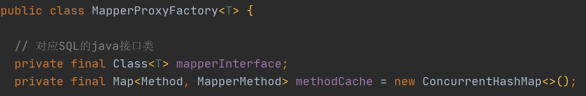

### Mybatis源码分析 

#### 1.  Mybatis开发的简单回顾

~~~markdown
1. Mybatis做什么？
   Mybatis是一个ORM类型框架，解决的数据库访问和操作的问题，对现有JDBC技术的封装。
2. Mybaits搭建开发环境 
   1. 准备jar
     <dependency>
        <groupId>org.mybatis</groupId>
        <artifactId>mybatis</artifactId>
        <version>3.4.6</version>
     </dependency>
     <dependency>
       <groupId>mysql</groupId>
       <artifactId>mysql-connector-java</artifactId>
       <version>5.1.48</version>
     </dependency>
   2. 准备配置文件
      a. 基本配置文件 mybatis-config.xml
         1. 数据源的设置 environments
         2. 类型别名
         3. mapper文件的注册
      b. Mapper文件
         1. DAO规定方法的实现 --> SQL语句 
   3. 初始化配置 
      mybatis-config.xml
      配置 environment
3. 开发步骤 7步
   1. entity
   2. 类型别名
   3. table 
   4. DAO接口
   5. Mapper文件
   6. Mapper文件的注册
   7. API编程 
~~~

#### 2. 核心代码分析

~~~java
InputStream inputStream = Resources.getResourceAsStream("mybatis-config.xml");
SqlSessionFactory sqlSessionFactory = new SqlSessionFactoryBuilder().build(inputStream);
SqlSession sqlSession = sqlSessionFactory.openSession();
// 用法一：
UserDAO userDAO = sqlSession.getMapper(UserDAO.class);
List<User> users = userDAO.queryAllUsers();
// 用法二：
List<User> users = sqlSession.selectList("org.zuel.dao.UserDAO.queryAllUsers");
~~~

~~~markdown
SqlSession的两种使用方式功能等价
哪种方式好？
  	第一种方式好，因为表达概念更清晰，可以直接体现出在操作哪个表 
第一种好，为什么还有第二种？
    第一种开发本质上就是对第二种开发的封装（代理设计模式）。历史上先有的是第二种，在使用过程中演变成第一种
~~~

#### 3. Mybaits的核心对象

本质上看，MyBatis是对JDBC的封装，使用SqlSession类实现了封装

在JDBC中，核心类型 Connection Statement ResultSet

除此之外，MyBatis的核心类型还有SqlSessionFactory

mybatis-config

mapper.xml

##### 3.1 Mybatis的核心对象及其作用

###### 1）数据存储类对象

**概念：**在Java中（JVM）对Mybatis相关的配置信息进行封装，一次性读取，避免多次IO

mybatis-config.xml 对应 Configuration，Configuration类3个主要作用：

- 封装mybatis-config.xml

- 封装Mapper.xml文件，体现在Configuration中的mappedStatements属性，Map类型

~~~markdown
- MappedStatement对象对应的就是Mapper文件中的一个一个的配置标签 
      <select id= xxxxx>	MappedStatement
      <insert id= xxxxx>	MappedStatement 
因此，在一个Mybatis应用中会有N个MappedStament对象，MappedStatement中包含了statementType属性，代表的就是对JDBC中的3种statement：
	statement
	preparedStatement
	callableStatement
MyBatis默认使用的是preparedStatement

MappedStatement中也有Configuration属性，Configuration和MappedStatement之间构成双向的联系

MappedStatment中封装SQL语句 ---> BoundSql
~~~

- 创建Mybatis其他核心对象 Executor/ParameterHandler/ResultSetHandler/StatementHandler

###### 2）操作类对象

- Executor

~~~markdown
Excutor是Mybatis中处理功能的核心，SqlSession将具体操作交由Executor完成
	1. 增删改update  查query
    2. 事务操作：提交 回滚
    3. 缓存相关的操作
Excutor接口
	为什么Executor要设计成接口？
	设计原则：操作相关的类型，一般考虑设计成接口，例如xxxService/xxxDAO
Executor接口的实现：
    BatchExecutor
        JDBC中批处理的操作，BatchExcutor 
        批处理：创建一次连接，执行多条SQL语句
    ReuseExecutor（实际用的很少）
        目的：复用Statement，下面两条语句最终的SQL不一致，不能复用Statement
            insert into t_user (ID，name) values (1，'孙帅');
            insert into t_user (ID，name) values (2，'孙帅1');
    SimpleExecutor
        最常用的Excutor，Mybatis默认
        体现在Configuration类中
		protected ExecutorType defaultExecutorType = ExecutorType.SIMPLE;
~~~

- StatmentHandler

~~~markdown
StatementHandler是Mybatis对JDBC中Statement的封装，真正Mybatis进行数据库访问操作的核心
为什么有了Executor完成CRUD操作，又构建一层StatementHandler？
	单一职责原则：Executor不仅要完成CRUD操作还要完成事务和缓存相关的操作，因此将CRUD操作交由StatementHandler单独完成
功能：增删改差
StatementHandler接口
    SimpleStatementHandler
        JDBC操作 
    PreparedStatementHandler
    CallableStatementHandler 
~~~

- ParameterHandler

~~~markdown
目的：Mybatis参数替换成JDBC参数 
     @Param ---> #{} ---> ?
~~~

- ResultSetHandler

~~~markdown
目的：对JDBC中查询结果集ResultSet进行封装 
~~~

- TypeHandler

    Java程序操作 数据库
    Java类型   数据库类型
        String    varchar
        int       number
        int       int 

##### 3.2 Mybatis的核心对象如何与SqlSession建立的联系？

~~~java
Mybatis源码中的这些核心对象 在SqlSession调用对应功能时建立联系 

SqlSession.insert()
     DefaultSqlSession
             Exctutor
                 StatementHandler 
SqlSession.update()
SqlSession.delete()
SqlSession.selectOne();
...
  
  
底层：
    SqlSession.insert()
	SqlSession.update()
    SqlSession.delete()
    ....

应用层面：
    UserDAO userDAO =  SqlSession.getMapper(UserDAO.class);
    // 获取的是UserDAO接口的实现类的对象，接口无法实例化
    // 疑问？ UserDAO接口实现类在哪里？
    // 答：动态字节码技术 ---> 类在JVM运行时创建，即创建了UserDAO接口的实现类，JVM运行结束后消失 
    // 动态字节码技术
	1. 如何使用动态字节码创建UserDAO/XXXDAO接口的实现类 
        - 代理 （动态代理）的明显特征？当出现下列情况时考虑使用代理
        a. 为原始对象（目标）增加“额外功能”，这里的额外功能是与本类功能不相关的功能 
        b. 远程代理 1.网络通信 2.数据传输 （RPC）Dubbo 
        c. 无中生有 接口实现类，我们看不见实实在在的类文件，但是运行时却能体现出来。
        - 动态代理核心代码        
        Proxy.newProxyIntance(ClassLoader,Interface,InvocationHandler)
            
  	2. 实现类如何实现CRUD？直接调用SqlSession对应方法             
        interface UserDAO{
        	List<User> queryAllUsers();         
        	save(User user)
    	}
		UserDAOImpl implements UserDAO {
    		queryAllUsers() {
        		sqlSession.select("namespace.id",参数)
            		|-Executor
            		|-StatementHandler
            		|- ParameterHandler , ResultSetHandler
            						TypeHandler 
    		}
            save(){
                sqlSession.insert("namespace.id",参数)
            }
        }
~~~

~~~markdown
MyBatis 完成代理创建 核心类型 ---> DAO接口的实现类 
1.	MapperProxy implements InvocationHandler（相当于上面自己编写的MyMapperProxy）
        invoke
              SqlSession.insert 
                         update
                         delete
                         selectOne
                         selectList
  
          SqlCommand:
                1. id = namespace.id
                2. type = insert|delete|select 
                          SqlSession.insert()
                          SqlSession.delete
                          ....
~~~

~~~java
@Override
  public Object invoke(Object proxy, Method method, Object[] args) throws Throwable {
    try {
      if (Object.class.equals(method.getDeclaringClass())) { // 继承自Object的方法
        // 直接执行原有方法
        return method.invoke(this, args);
      } else if (method.isDefault()) { // 默认方法
        // 执行默认方法
        return invokeDefaultMethod(proxy, method, args);
      }
    } catch (Throwable t) {
      throw ExceptionUtil.unwrapThrowable(t);
    }
    // 找对对应的MapperMethod对象
    final MapperMethod mapperMethod = cachedMapperMethod(method);
    // 调用MapperMethod中的execute方法
    return mapperMethod.execute(sqlSession, args);
  }
~~~

~~~markdown
2.	MapperProxyFactory
    Proxy.newProxyInstrace()
~~~

